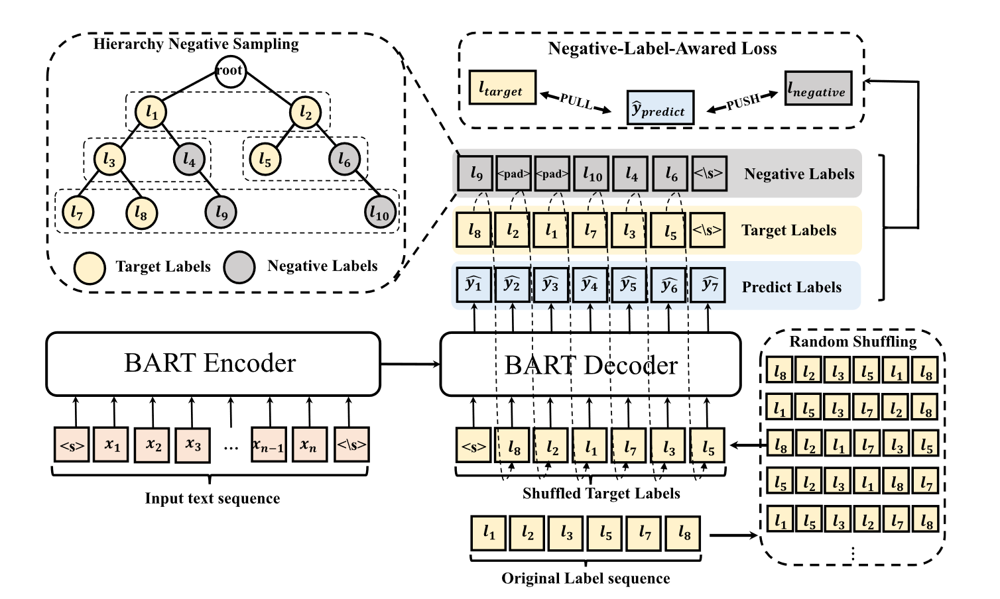

#  Does the Order Matter? A Random Generative Way to Learn Label Hierarchy for Hierarchical Text Classification [[中文](./README.md) | English]

**Abstract**: Hierarchical Text Classification (HTC) is an essential and challenging task due to the difficulty of
modeling label hierarchy. Recent generative methods have achieved state-of-the-art performance by flattening the local
label hierarchy intoalabelsequence with a specific order. However, the order between labels does not naturally exist and
the generation of the current label should incorporate the information in all other target labels. Moreover, the
generative methods usually suffer from the error accumulation problem. To this end, we propose a new framework named
sequence-to-label (Seq2Label) with a random generative way to learn label hierarchy for hierarchical text
classification. Instead of using only one specific order, we shuffle the label sequence by a Label Sequence Random
Shuffling (LSRS) mechanism so that a text will be mapped to several different order label sequences during the training
phase. To alleviate the error accumulation problem, we further propose a Hierarchy-aware Negative Sampling (HNS)
strategy with a negative label-aware loss to better distinguish target labels and negative labels. In this way, our
model can capture the hierarchical and co-occurrence information of the target labels of each text. The experimental
results on three benchmark datasets show that Seq2Label achieves state-of-the-art results.
 </div>

## Dependency

```
pip install requirements.txt
```

## Dataset

- [WOS](https://github.com/kk7nc/HDLTex)
- [RCV1](http://www.ai.mit.edu/projects/jmlr/papers/volume5/lewis04a/lyrl2004_rcv1v2_README.htm)
    - **Note**：The useful data needs to be available from the [link](https://trec.nist.gov/data/reuters/reuters.html).
- [BGC](https://www.inf.uni-hamburg.de/en/inst/ab/lt/resources/data/blurb-genre-collection.html)

The processed dataset can be accessed from the
link. [百度网盘](https://pan.baidu.com/s/182WLuouZRU5CNivmJaDOHg?pwd=1234 )

Each dataset includes the following files: `label.taxonomy`, `train.pkl`, `test.pkl`, and `valid.pkl`. Among
them, `label.taxonomy` preserves the hierarchical information between labels.

**Dataset Format**: (text, label, sparse vector), where the label is a list recording all the labels of the text; the
sparse vector is a vector of the length of the number of labels, with the vector`[label_index] = 1`.

## Train

- Specify the model path in `config.yaml`, the default is `facebook/bart-base`, the run will automatically download the
  pre-trained model parameters from huggingface. If there are network problems, please download the parameters from
  huggingface and change the path to your local location.
- In `train.sh` specify the model `model`, the dataset `dataset`, the labeling order `mode`, and the dataset
  root `data_path`, using your configured python environment.
- Execute the following script:

```
  bash train.sh
```

## Cite

```
@article{yan2023does,
  title={Does the Order Matter? A Random Generative Way to Learn Label Hierarchy for Hierarchical Text Classification},
  author={Yan, Jingsong and Li, Piji and Chen, Haibin and Zheng, Junhao and Ma, Qianli},
  journal={IEEE/ACM Transactions on Audio, Speech, and Language Processing},
  year={2023},
  publisher={IEEE}
}
```
